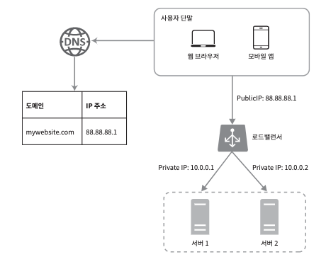
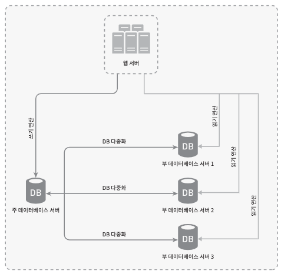
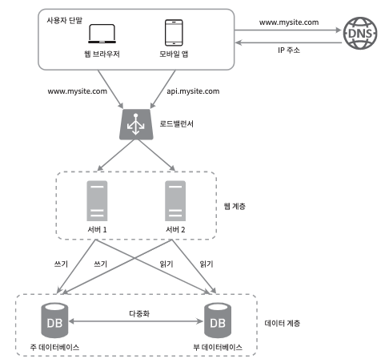

# 사용자 수에 따른 규모 확장성

## 핵심 요약

<!-- 이 장의 핵심 내용을 3-5줄로 간략하게 요약 -->
-  

## 중요 개념

<!-- 이 장에서 가장 중요한 개념들을 나열 -->

## 단일 서버

### 사용자 요청 처리 흐름

1. 도메인으로 웹사이트 접속
2. DNS에서 IP 주소로 변환 -> DNS는 보통 제 3 사업자(AWS Route53, 가비아 등)을 이용하므로 우리 서비스가 아님
3. 해당 IP 주소로 HTTP 요청
4. 요청 받은 웹 서버는 HTML, Json 등으로 응답 반환

## 데이터베이스

> 사용자의 증가로 DB 서버분리

> 어떤 DB를 사용할까? RDBMS? NoSQL?

**비관계형 DB 종류**

- key-value store, graph store, column store, document store

### NoSQL이 적합할 수 있는 경우

- 아주 낮은 응답 지연시간(latency) 요구
- 다루는 데이터가 비정형(unstructured)이라 관계형 데이터가 아님
- 데이터(JSON, YAML, XML 등)를 직렬화(serialize), 역직렬화(deserialize)할 수 있기만 하면 됨
- 아주 많은 양의 데이터를 저장할 필요가 있음

## 수직적 규모 확장 vs 수평적 규모 확장

### 수직적 확장

- 좋은 선택인 경우: 서버로 유입되는 트래픽 양이 적을 때
- 장점:
    - 단순함
- 단점:
    - 한 대의 서버에 CPU나 메모리를 무한대로 증설하는 방법은 없다.
    - 장애에 대한 자동복구(failover) 방안이나 다중화(redundancy) 방안이 제시되지 않는다.
        - 즉, 단일 서버에 장애가 발생하면 완전 중단
    - 사용자가 너무 많아지면 느려지거나 서버 접속 불가능

> 위의 단점을 해결하는 방법

### 로드 밸런서

- 부하 분산 집단(load balancing set)에 속한 웹 서버들에게 트래픽 부하를 고르게 분산하는 역할

- 사용자는 로드밸런서의 Public IP 주소로 접속
    - 웹 서버가 클라이언트 접속을 직접 처리하지 않는 것
- 더 나은 보안을 위해 서버 간의 통신에 Private IP 주소 이용
    - Private IP 주소는 같은 네트워크에 속한 서버 사이의 통신에만 쓰일 수 있는 IP 주소로 인터넷을 통해 접속 불가능
- 이로 인해 failover 문제 해소 및 웹 계층의 가용성(availability) 향상

**로드밸런서로 해결 가능한 상황**

- 사진에서 서버 1이 다운되면 모든 트래픽은 서버 2로 전송
    - 웹 사이트가 단일 서버에 종속적이지 않음
    - 부하를 나누는 것 가능
- 웹사이트로 유입되는 트래픽이 가파르게 증가하면 두 대의 서버로 트래픽을 감당할 수 없는 시점에 로드밸런서가 대처 가능
    - 웹 서버 계층에 더 많은 서버를 추가하기만하면 로드밸런서가 자동으로 트래픽을 분산.

> 지금까지는 웹 계층이고, 데이터 계층은 어떻게 해결할 것인가?

### 데이터베이스 다중화

-> 보통 애플리케이션에서는 읽기 연산이 더 많으므로 보통 slave가 더 많은 구조를 가짐

- 보통 다중화라하면, master-slave 관계를 설정하고, 데이터 원본은 master에 사본은 slave에 저장하는 방식을 말한다.
    - 쓰기 연산(write operation): master에서만 지원
    - slave에서는 읽기 연산만 가능
- 장점:
    - 모든 데이터 변경 연산은 master DB 서버로만 전달되고, 읽기 연산은 slave DB 서버들로 분산됨
        - 병렬로 처리될 수 잇는 Query 수가 늘어남 -> **성능 향상**
    - 물리적인 이유로 DB 서버가 파괴되더라도 데이터가 보존 -> **안전성 항샹**
    - 데이터를 여러 지역에 복제해 둠으로써, 하나의 DB 서버에 장애가 발생하더라도 다른 서버에 있는 데이터를 가져와서 서비스 가능

**DB 다중화로 해결 가능한 상황**

- slave 서버가 한 대 뿐인데 다운된 경우
    - 읽기 연산은 한시적으로 master 서버에 전달
    - 즉시 새로운 slave 서버가 장애 서버를 대체
    - slave 서버가 여러 대인 경우 읽기 연산은 나머지 slave 서버들이 분산, 새로운 DB 서버가 장애 서버 대체
- master 서버가 다운된 경우
    - 하나의 slave 서버만 더 있는 경우 -> 해당 slave 서버가 새로운 master 서버가 됨.
    - 모든 DB 연산이 일시적으로 새로운 master 서버에서 수행.
    - 새로운 slave 서버 추가
- 실제 production 환경에서 master 서버가 다운된 경우 더 복잡함
    - **slave 서버에 보관된 데이터가 최신 상태가 아닐 수 있음**
    - 없는 데이터는 복구 스크립트(recovery script)를 돌려서 추가해야함
    - multi-masters나 circular replication을 도입하면 도움이 되지만, 훨씬 복잡하고 고려할 상황이 많아짐

## 로드 밸런서 + 데이터베이스 다중화

**동작 방식**

- 사용자는 DNS로부터 로드밸런서의 공개 IP 주소를 받는다.
- 사용자는 해당 IP 주소를 사용해 로드밸런서에 접속한다.
- HTTP 요청은 서버 1이나 서버 2로 전달된다.
- 웹 서버는 사용자의 데이터를 slave DB 서버에서 읽는다.
- 웹 서버는 데이터 변경 연산은 master DB 서버로 전달한다. insert, delete, update 등

> 이제 응답 시간(latency)를 개선해보자
>
> 응답 시간은 캐시를 붙이고, 정적 콘텐츠를 CDN으로 옮기면 개선 가능하다.

## 캐시

- 값비싼 연산 결과 또는 자주 참조되는 데잍터를 메모리 안에 두고, 뒤이은 요청이 보다 빨리 처리될 수 있도록 하는 저장소
- 애플리케이션 성능은 DB를 얼마나 자주 호출하느냐에 크게 좌우되므로 이를 줄이고자함.

### 캐시 계층

- 캐시 계층(cache tier)는 데이터가 잠시 보관되는 곳으로 DB보다 훨씬 빠르다.
- 별도의 캐시 계층을 두면
    - 성능 개선
    - DB 부하 절감
    - 캐시 계층의 규모를 독립적으로 확장도 가능

**캐시 우선 읽기 전략(read-through caching strategy)**

- 요청 받은 웹 서버는 캐시에 응답이 저장된지 본다.
- 저장되어 있다면 해당 데이터를 반환한다.
- 없다면 DB Query를 통해 데이터를 찾아 캐시에 저장한 뒤에 반환한다.

> 이외에도 다양한 전략이 있으니, 캐시할 데이터 종류, 크기, 액세스 패턴에 맞는 캐시 전략을 선택하면 된다.

### 캐시 사용시 유의할 점

- 캐시는 어떤 상황에 바람직한가?
    - 데이터 갱신은 자주 일어나지 않지만 참조는 빈번하게 일어날 때
- 어떤 데이터를 캐시해야하는가?
    - 영속적으로 보관할 데이터는 적합하지 않다.
- 캐시에 보관된 데이터는 어떻게 만료되는가?
    - 정책을 마련하자.(너무 짧지도, 길지도 않게)
- 일관성을 어떻게 유지할까?
    - **저장소의 원본을 갱신하는 연산과 캐시를 갱신하는 연산이 단일 트랜잭션으로 처리되지 않는 경우 일관성이 깨질 수 있다.**
    - 여러 지역에 걸쳐 시스템을 확장해 나가는 경우 캐시와 저장소 사이의 일관성을 유지하는 것은 어렵다.
- 장애는 어떻게 대처할까?
    - 캐시 서버를 한 대만 두는 경우 해당 서버는 단일 장애 지점(Single Point of Failure, SPOF)이 될 가능성이 있다.
    - SPOF는 어떤 특정 지점에서의 장애가 전체 시스템의 동작을 중단시켜버리는 경우를 말한다.
- 캐시 메모리는 얼마나 크게 잡을 것인가?
    - 캐시 메모리가 너무 작으면 액세스 패턴에 따라서 데이터가 너무 자주 캐시에서 밀려나버려(eviction) 캐시의 성능이 떨어지게 된다.
    - 이를 해결하는 방법은 캐시 메모리를 과할당(over provision)하는 것이다.
    - 이렇게 하면 캐시에 보관될 데이터가 갑자기 늘어났을 때 생길 문제도 방지가능하다.
- 데이터 방출(eviction) 정책은 무엇인가?
    - 캐시가 꽉 차버리면 추가로 캐시에 데이터를 넣어야할 경우 기존 데이터를 내보내야 한다. -> 데이터 방출이라 함
    - LRU(Least Recently Used) : 사용된지 가장 오래된 데이터를 내보내는 정책, 가장 널리 쓰임
    - LFU(Least Frequently Used) : 사용된 빈도가 가장 낮은 데이터를 내보내는 정책
    - FIFO(First In First Out) : 가장 먼저 들어온 캐시 데이터를 가장 먼저 내보내는 정책

## CDN(콘텐츠 전송 네트워크)

- 정적 콘텐츠를 전송하는 데 쓰이는 지리적을 분산된 서버의 네트워크
-

## 주요 내용

<!-- 중요한 세부 내용을 자유롭게 기록 -->
-

## 그림 & 다이어그램

<!-- 책에 있는 중요한 그림이나 다이어그램을 간단히 설명 -->
-

## 실제 적용 방안

<!-- 이 내용을 실무에 어떻게 적용할 수 있을지 -->
-

## 질문 & 의문점

<!-- 추가로 알아봐야 할 내용이나 의문점 -->
-

## 참고 자료

<!-- 관련된 추가 자료 -->
-
